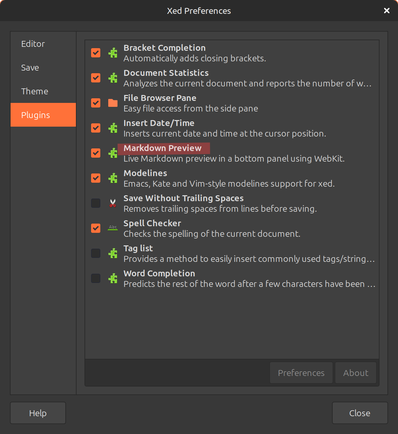
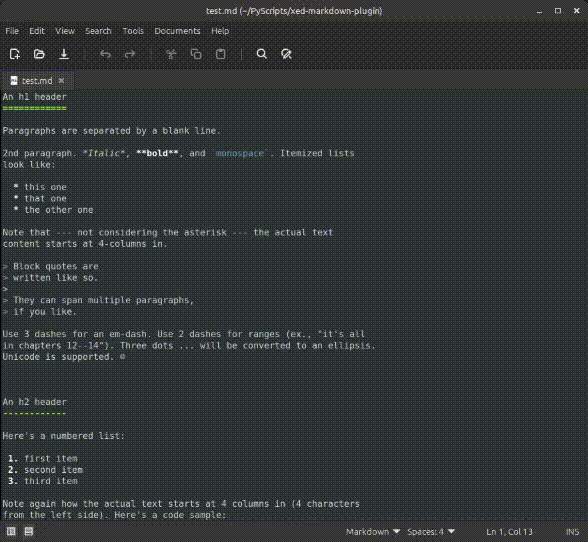

## Introduction

This is a small plugin for xed that does simple rendering of Markdown files using Python. The current version does not support CSS. I whipped this up quickly with help from GPT-5 for an immediate need I had. If I see enough demand, I could come back to this and add more features.

## Features 
- Simple rendering of Markdown files using Python. If `markdown` module is not available, it will do simple translation into HTML.
- No CSS support
- Renders markdown in Bottom Panel of xed

## Setup
- Copy the `.py` and `.plugin` files into ~/.local/share/xed/plugins
- Go to Edit->Preferences->Plugins and enable 'Markdown Preview'

## Usage
When a markdown file (.md) is loaded, it will be rendered in the bottom panel of xed. If the file is not a markdown file, no bottom panel will be visible. You can use the View->Bottom Pane menu item or the bottom panel visibility icon on the status bar to show or hide the panel. When opening the first md file of the session, you will probably need to drag the bottom panel handle up to reveal it.

## Future Development
It will be nice to add the following features at some point
- Scroll synchronization
- Github/Gitlab Markdown rendering support
- Custom CSS

## License

This project is licensed under the [MIT](./License.md) license.